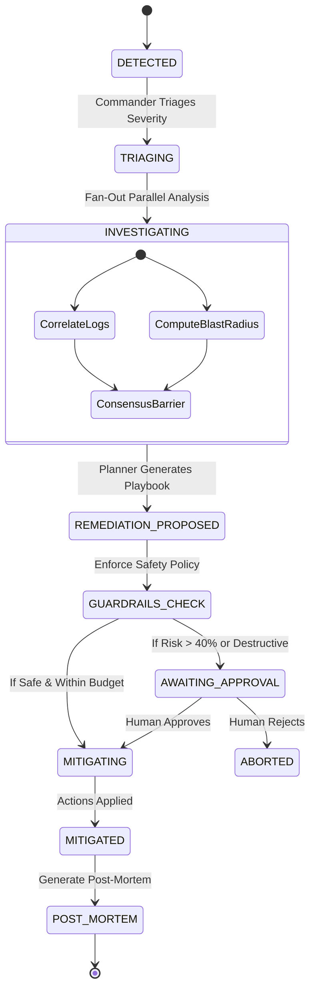

# Swarm State Graph & Execution Lifecycle

```mermaid
stateDiagram-v2
    [*] --> DETECTED
    DETECTED --> TRIAGING: Commander Triages Severity
    TRIAGING --> INVESTIGATING: Fan-Out Parallel Analysis
    
    state INVESTIGATING {
        [*] --> CorrelateLogs
        [*] --> ComputeBlastRadius
        CorrelateLogs --> ConsensusBarrier
        ComputeBlastRadius --> ConsensusBarrier
    }
    
    INVESTIGATING --> REMEDIATION_PROPOSED: Planner Generates Playbook
    REMEDIATION_PROPOSED --> GUARDRAILS_CHECK: Enforce Safety Policy
    
    GUARDRAILS_CHECK --> AWAITING_APPROVAL: If Risk > 40% or Destructive
    GUARDRAILS_CHECK --> MITIGATING: If Safe & Within Budget
    
    AWAITING_APPROVAL --> MITIGATING: Human Approves
    AWAITING_APPROVAL --> ABORTED: Human Rejects
    
    MITIGATING --> MITIGATED: Actions Applied
    MITIGATED --> POST_MORTEM: Generate Post-Mortem
    POST_MORTEM --> [*]
```
